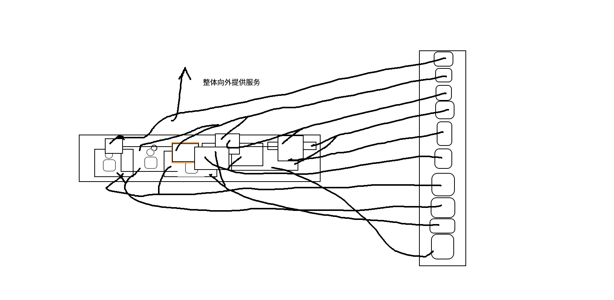
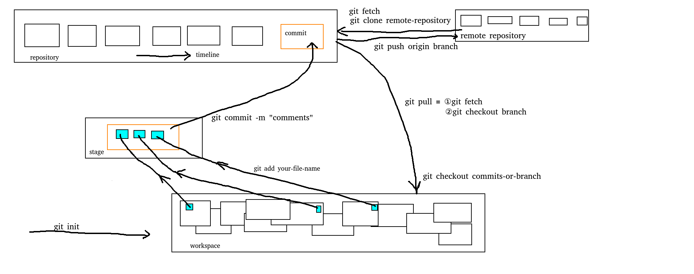

# 安装 git 并简单使用。

## 下载并安装 git

在 ubuntu 中下载安装 git 还是比较简单的，

我们可以打开 terminal 终端，首先敲击 `git` 命令，如果我们系统还没有安装 git， console 会提示我们“尚未安装 git”，并且给出 `sudo apt install git` 的命令，这个时候我们只需要复制这条命令，然后粘贴到命令行执行就可以了。

```bash
sudo apt install git 

# 下面就是长篇的安装输出提示，可能会要求我们输入 Y，输入即可
# ....
```

安装完成之后， git 就可以作为我们的一个工具来使用了。

## Git 概论

对于一个完整的项目来说，可能包含了很多的模块，整体向外提供一套完整的服务。我们在项目的开发的过程中，可能会首先编写一个模块的代码，然后再开发另一个模块的代码。对于一个中大型的项目，甚至会不同的人负责不同的模块进行开发。

在项目创建初期，各个模块之间的关联关系比较清晰，每个开发者的职责划分也比较清晰。不过为了更好地审视整个系统的功能，依然需要一个明确的方式来 review（审核） 代码。比如 模块（或类）A 的同事依赖调用 模块（或类）B 的接口，那么架构层面的负责人可能会同时查看两个模块的代码，从而保证各自的逻辑是恰当的。同时也要能够跟踪每条语句的作者，一方面可以记录贡献，另一方面在出现疑问或问题的时候也可以第一时间找到编码者进行答疑或修正。

到功能迭代阶段，除去新的模块或类，一般还会修改已有的模块或类，这个时候就特别需要收集“老代码”的各种信息，比如作者、修改记录、注释、文档等；同时为了以后方便进一步迭代，需要留下当前的记录、注释、文档等。按照时间线把一次次变更详情记录下来，这就是 git 工具的核心功能。



上图中，左边表示我们项目视角的结构图，每个方框表示一个模块，各个模块相互联系耦合到一起共同形成一个系统，整体向外提供服务；右边表示 git 的提交（commit）视图，一次次的提交形成一个可追溯、“有序”（当引入分支以后局部次序也会显得比较乱）的链条。


## git中的概念

 

为了实现可追溯的链条，git 中包含了几个概念。

大家可以看这张图，我们把上一张图里 项目对应的 Git 仓库提交记录横过来展示了，现在左上角的这个躺着的是由一次次的提交记录组成的仓库。整个仓库直接保存在我们本地的磁盘上面，

1. 整个仓库可以来自于某个远端仓库，比如 github 里的 [https://github.com/chalver/book.git](https://github.com/chalver/book.git) 仓库，我们可以直接 `git clone remote-repository` 到我们的本地；
1. 除此之外呢我们也可以在我们的工作目录直接通过 `git init` 命令初始化一个本地的仓库。

大家可以看到 workspace 就是我们正常编写内容的工作区域。当我们打开一个由 git 管理的项目的时候，里面可能已经包含了很多的代码，而且代码是以文件的形式分模块存在的。我们可能会在已有的某几个模块修改已有的函数或者提交几个新的函数，为了把我们修改的内容提交到 git 仓库，我们首先需要把我们的修改 `git add` 到 stage 暂存空间，我们可以每修改一点内容都 `git add` 到整个空间，从而为我们创建新的 commit 提交做准备。

在 stage 空间，工作区域分散在各处的修改点被整合到一起。我们可以通过 `git status` 命令查看 stage 空间里暂存的内容。

当我们对工作区域的修改感到满意了，把内容全部添加到缓存区，那么我们就可以通过 `git commit` 来把我们的修改提交到本地仓库了。这里我们可以通过在 `git commit -m "本次提交的内容"` 后添加注释来注明本地提交了什么内容。

如果我们本地的仓库来自于一个远端仓库，或者我们本地初始化的仓库配置了对应的远端仓库，我们可以通过 `git push` 来把本地仓库的更新同步到远端仓库。

当多人协作的时候，可能出现多人同时编写同一个仓库的情况，我们 `git push` 本地仓库的时候可能远端的仓库已经被别人更新过了，此时我们就没有办法 push 仓库了。不过整个时候我们可以通过 `git pull` 来 merge 别人的更改，这样就可以继续 push 我们的代码到远端了。


git 中还存在分支的概念，尤其在多人协作的时候尤其重要。不过这部分的内容比较复杂且对开发者的实践要求比较高，我会在后面的课程里再单独拎出来介绍。大家可以先尝试熟练掌握本节的内容。

## 在 vscode 中使用 git

vscode 天然集成了 git 环境，在安装 git 工具以后就可以通过左边的版本控制按钮来到对应的界面。

我们可以通过 vscode 里提供的图形界面进行上面提到的各项操作，也可以在 vscode 的 terminal 里手动输入各个命令进行操作。

我个人比较习惯通过命令行的方式操作，避免点错按钮（有的按钮挨着比较近，一个不小心可能导致自己丢失辛辛苦苦修改的内容）。大家可以根据喜好做选择，不过如果大家选择图形界面进行操作，建议大家多多练习一下，避免误操作导致不可挽回的损失=。=。


大家可以通过查看 output 标签来查看图形界面每个操作的具体 git 命令，大家可以看到我们的一个按钮可能引发这么多的 git 命令的执行。里面有很多的命令可能是我们根本不会手动去敲的，因此不推荐大家去看它，不过在大家对 git 的感知到了某个境界以后，可以通过这里的内容进行探索，比如了解一下各个命令的实际作用，尝试打开另外一个世界的大门。


### 通过图形界面实战
1. 克隆 `https://github.com/chalvern/books.git`
1. 修改内容并添加到暂缓区
1. 提交
1. 推到远端
1. 课堂展示2。

### 通过命令行实战

1. `git clone https://github.com/chalvern/books.git`
1. `git add .`
1. `git commit -m "add sth"`
1. `git push`
1. 课堂展示。


## 小结

本文简单介绍了 git 的安装与初级使用。

