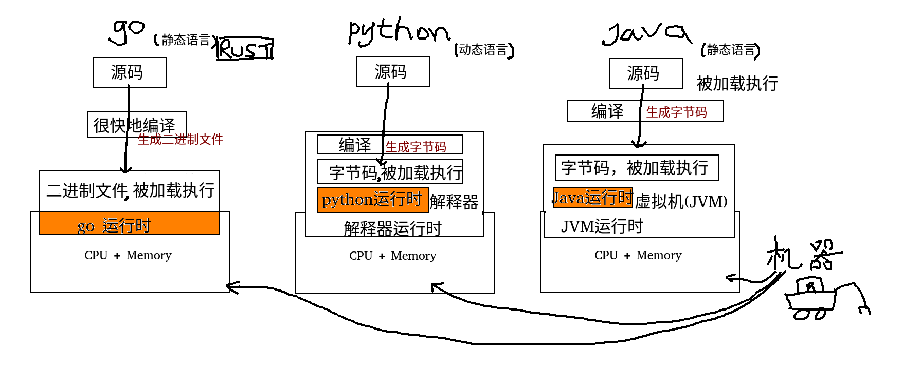

# 终于开始编程语言 python 和 go 的学习了

## 为什么是 python 和 go 这两门语言

作为一个系列课程，可能有必要详尽地说明一下，为什么选择的是 python 和 go 这两门语言；有的同学可能更希望选定的是 Java、Rust、C/C++ 等其他语言。

在前面的课程里有提到过， python 是我目前工作的主要编程语言， go 是我曾经主力使用且一直跟踪其发展的编程语言。而且站在一个稍微有点经验的程序员的视角，**不存在最好的语言，只存在最适合的语言**。作为一名中高级的开发者，大家会发现自己平日里的工作所解决的困难都是业务相关的复杂度，编程语言的迁移（假如真的存在这种情况）相对反而会是比较容易的，只要团队里有比较靠谱的人带队，从入门到有产出花不了太多时间。

不过，根据 [TIOBE](https://www.tiobe.com) 指数 Java 依然是最流行的工业级编程语言，其热度长期占据排行榜首位，大家可以自行斟酌吧。

## 简单对比go/python/java的模型

在正式开始 python 和 go 的学习之前，让我们首先简单地比较一下几种编程语言的模型，这里我选择了比较有代表性的 go、python 和 java。

我们看一下各个编程语言“从源码到机器执行”所经历的环节。大家都是从源码开始，最终都是电脑的 CPU 和 内存来承载执行源码对应的逻辑。

首先我先给大家注点鸡血，程序员写代码控制的主要是 CPU 和 内存，它们属于机器的一种；挖掘机或其他的车也是机器的一种，如果我们能够合理地摆弄那几个操纵杆学会开车，那么没有理由学不会开电脑。唯手熟尔，仅此而已。

### go语言
好，接下来让我们首先看一下 go 语言。go 诞生自 2009 年，和 python（1991）、Java（1995）比起来算是一门比较新的语言，理论上具有后发优势，语言特性会比较先进。这也是建议大家学习它的一个原因。

和 c 语言类似，go 语言经过编译后会生成可以直接执行的二进制文件。图中使用“很快地编译“，是因为 go 语言编译起来确实非常快；我们可以拿另一个比较新且流行的编程语言 Rust 简单对比，前者的编译速度比后者可以快一个数量级。举个例子，如果 Rust 项目编译使用 30 分钟（TiKV 项目），那么 go 语言复杂度相当的项目（TiDB）可能不需三分钟就构建完成了。

go 编译生成的二进制文件可以直接被加载到机器上运行，干脆利落。也就是说，go 编译生成的二进制文件直接是机器可识别的内容。这与 python 和 java 是完全不同的。

### java 语言

### python 语言

使用 python 开发，从源码到机器执行并没有显式地编译过程，只需把源码加载到解释器就可以正常运行了。

那么 python 源码是如何运行在**机器**上的呢？根据常识，类似 `1+1` 这样的源码是不可能直接在 CPU 上执行的，实际上 python 解释器会在内部把 python 源码编译形成一种字节码，然后把这些字节码加载到解释器的运行时进行执行。

不过，根据 [TIOBE](https://www.tiobe.com) 指数 Java 依然是最流行的工业级编程语言，其热度长期占据排行榜首位，大家可以自行斟酌吧。

## 简单对比go/python/java的模型

在正式开始 python 和 go 的学习之前，让我们首先简单地比较一下几种编程语言的模型，这里我选择了比较有代表性的 go、python 和 java。

我们看一下各个编程语言“从源码到机器执行”所经历的环节。大家都是从源码开始，最终都是电脑的 CPU 和 内存来承载执行源码对应的逻辑。

首先我先给大家注点鸡血，程序员写代码控制的主要是 CPU 和 内存，它们属于机器的一种；挖掘机或其他的车也是机器的一种，如果我们能够合理地摆弄那几个操纵杆学会开车，那么没有理由学不会开电脑。唯手熟尔，仅此而已。

### go语言
好，接下来让我们首先看一下 go 语言从源码到运行的环节。go 诞生自 2009 年，和 python（1991）、Java（1995）比起来算是一门比较新的语言，理论上具有后发优势，语言特性会比较先进。这也是建议大家学习它的一个原因。

和 c 语言类似，go 语言经过编译后会生成可以直接执行的二进制文件。图中使用“很快地编译“，是因为 go 语言编译起来确实非常快；我们可以拿另一个比较新且流行的编程语言 Rust 简单对比，前者的编译速度比后者可以快一个数量级。举个例子，如果 Rust 项目编译使用 30 分钟（TiKV 项目），那么 go 语言复杂度相当的项目（TiDB）可能不需三分钟就构建完成了。

go 编译生成的二进制文件可以直接被加载到机器上运行，干脆利落。也就是说，go 编译生成的二进制文件直接是机器可识别的内容。这与 python 和 java 是完全不同的。

### python 语言

## 对技术（包括编程语言）怀有敬畏之心

